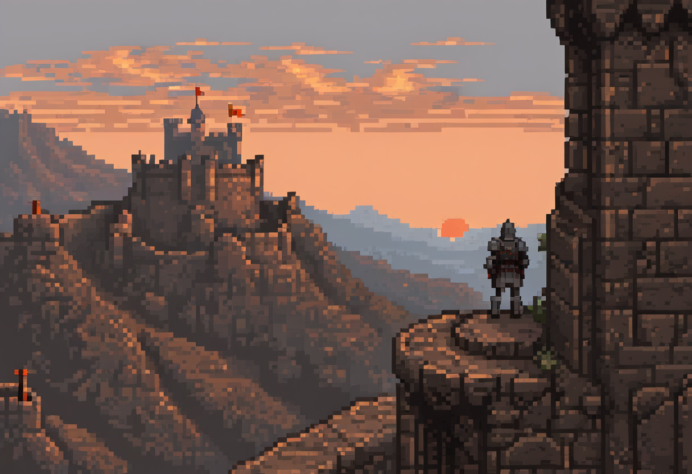

# The Long Game

{fig-alt="Pixel-art illustration: an armoured watchman on a high rampart overlooking a castle and distant hills at sunset."}

> *A defence plan should make its limits as visible as its controls.*

You now have the pieces of a defender's dossier. The final test changes the
budget and recovery target. It asks whether you can recognise an unresolved
risk and explain it to the person authorised to decide. A polished plan
that hides a failed test is less useful than a short one that exposes it.

## What this chapter covers

By the end you should be able to:

- Connect assets, controls, evidence and recovery decisions in one plan.
- Check whether a changed requirement invalidates an earlier answer.
- Distinguish a justified decision from a claim that everything is secure.
- Assign responsibility for unresolved risk and future review.

## Joining the dots

Return to the seven activities introduced in chapter 1: design, harden,
detect, respond, recover, investigate, and audit/learn. Human decisions
run through every activity. These are overlapping tasks, not seven
departments that hand an incident along in a fixed sequence.

At Harbour, permissions influence whether a login can become a bulk export.
Logging affects what the response lead can establish. Recovery credentials
affect whether backups survive. A notification assessment may still be open
after the service is restored. Those connections are what the dossier should
make visible.

A checklist can help an authorised responder avoid missing a necessary step.
It needs an owner, a context and testing. The failure is treating checked
boxes as proof that the service can meet its obligations under changed
conditions.

## Complete the independent case

Use [Harbour's weekend programme](../appendices/defender-dossier.qmd#sec-transfer).
Allow 30–45 minutes, working alone without AI. The appendix supplies every
changed fact and an eight-point check. Write your answer before reading
the comparison.

Your one-page decision needs the assets and permissions, an affordable
control choice, risk arithmetic, allowed and denied tests, both recovery
checks, an evidence-preserving response and a privacy escalation. End with
what is ready, what is not, who can decide, and what evidence is needed next.

You are not required to make the constraints fit. If the stated recovery
time misses the target or the budget leaves a known boundary weakness,
say so. Do not create an imaginary free control to make the answer look
complete. An explicit request for a changed budget, a tested improvement
or a deferred launch is a legitimate result.

## Check and transfer

Compare your answer with the
[reasoning check](../appendices/defender-dossier.qmd#sec-transfer-check).
Aim for seven of eight criteria, with no unsafe testing, unsupported readiness
claim or missed recovery-target failure. If you disagree with the worked
choice, identify the constraint and evidence that make your alternative
defensible.

For a second attempt, ask another reader to change one supplied constraint.
Predict which section of your dossier must change before recalculating it.
That is a stronger test of understanding than repeating the original answer.

::: {.callout-tip}
## Play the whole thing

Every stage in that loop is easier to *understand* than to *do*. Doing it, under time and
budget pressure, is where the judgement lives. *Incident Zero*, the free print-and-play game
referenced throughout these chapters, has a full campaign that runs this entire lifecycle end
to end: design a network, harden it, detect and respond to a breach, recover from the disaster,
and investigate what happened. Playing it is the closest thing to *living* a security cycle in
an afternoon. If this book gave you the map, the campaign lets you walk the ground. →
[incidentzero.retroverse.studio](https://incidentzero.retroverse.studio/)
:::

The game is optional group enrichment. Its current
[landing page](https://incidentzero.retroverse.studio/) describes the player,
printing and time requirements. The paper dossier above is a complete solo
route and does not reproduce the game's materials.

## Questions to consider

1. Which supplied fact most changed your control choice, and why?
2. Which conclusion depends on evidence you do not yet have?
3. What should trigger a new review after an initially acceptable plan?

## Carry the decision forward

Keep the dossier as a record of a decision under stated conditions. When
the system, staff, evidence or obligations change, revisit it. The useful
habit is to explain what a control does, demonstrate it where possible,
and make the remaining uncertainty visible to the right decision-maker.
